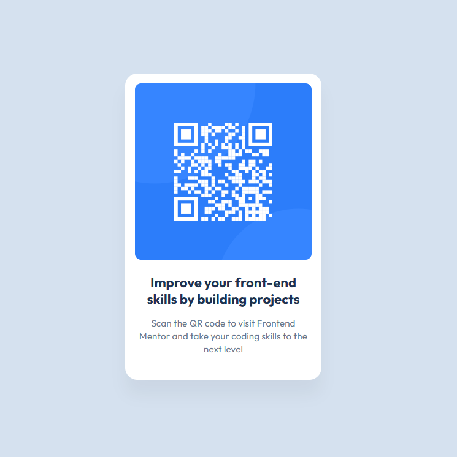

# Frontend Mentor - QR code component solution

This is a solution to the [QR code component challenge on Frontend Mentor](https://www.frontendmentor.io/challenges/qr-code-component-iux_sIO_H). Frontend Mentor challenges help you improve your coding skills by building realistic projects.

## Table of contents

- [Overview](#overview)
- [My process](#my-process)
- [Author](#author)

**Note: Delete this note and update the table of contents based on what sections you keep.**

## Overview

- Solution URL: [https://github.com/maxim-green/qr-code-component-main](https://github.com/maxim-green/qr-code-component-main)
- Live Site URL: [https://maxim-green.github.io/qr-code-component-main/](https://maxim-green.github.io/qr-code-component-main/)

## My process

Built with:

- WebStorm
- Semantic HTML5 markup
- CSS properties
- Flexbox

## Author

- Website - [Maxim Green](https://maxim-green.github.io/)
- Frontend Mentor - [@maxim-green](https://www.frontendmentor.io/profile/maxim-green)